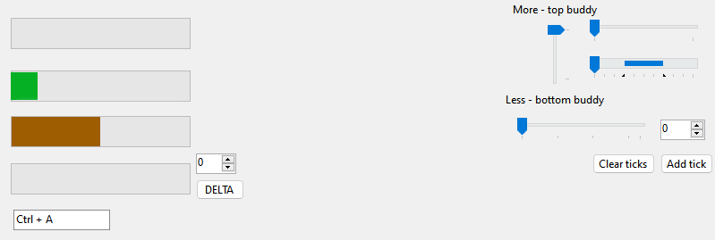

# WinInteropUtils.WinForms
`WinInteropUtils.WinForms` is a sub-package of WinInteropUtils that provides Windows Forms (WinForms) wrappers for Win32 controls such as track bars, progress bars, or hyperlink controls.

## Controls
`WinInteropUtils.WinForms` currently has the following control wrappers:
- [Slider](slider.md) (Win32: `Track Bar`)
- [ProgressBarEx](progbarex.md) (Win32: `ProgressBar`)
- [HyperLink](hyperlink.md) (Win32: `SysLink`)

## What is WinInteropUtils.WinForms for?
`WinInteropUtils.WinForms` allows you to make better apps with new Win32 controls that are not built-in by default with WinForms or extended versions of the built-in controls that support all the features of the native Win32 control.

## Install WinInteropUtils.WinForms
`WinInteropUtils.WinForms` is inside the same branch and repository on Git as the main `WinInteropUtils` package. To use it, you can go to the same [releases](https://github.com/FireBlade211/WinInteropUtils/releases) page as the main `WinInteropUtils` library, but get the `WinInteropUtils.WinForms.dll` file instead of the base `WinInteropUtils.dll` file. Alternatively, you can install the package on [NuGet](https://www.nuget.org/packages/WinInteropUtils.WinForms).

## Add the controls to the Toolbox
If the controls don't show up in your WinForms designer's toolbox after installation, you need to do the following steps:
1. Inside the Toolbox, right-click on the header where you'd like the `WinInteropUtils.WinForms` controls to be located, and click **Choose Items...** . 
2. Inside the dialog, find and check the controls to add. If you need all the controls, make sure you check:
    - Slider
    - ProgressBarEx
    - HyperLink 

    Make sure that the namespace(s) of the controls you checked are all `FireBlade.WinInteropUtils.WinForms`.
    > [!TIP]
    > You can use the **Filter** box to search through the list to find the controls easier.
3. Once done, press **OK**. The checked controls should now show up in the toolbox.

## Additional info
The base namespace for all `WinInteropUtils.WinForms` controls is `FireBlade.WinInteropUtils.WinForms`.