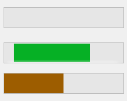
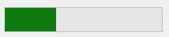
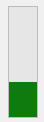

# ProgressBarEx control
The `ProgressBarEx` control is an extended version of the WinForms `ProgressBar` control that provides all the features of the Win32 `ProgressBar`.



## Range
To set the range of the progress bar, use the `Maximum` and `Minimum` properties. To set the value of the progress bar, set the `Value` property:

```cs
progressBarEx1.Minimum = 0;
progressBarEx1.Maximum = 250;
progressBarEx1.Value = 125;
```

## Progress Bar Types
A progress bar type is the type of movement of the progress bar. It can be one of the following values:
- `Marquee`
- `Blocks`
- `Smooth`

`Marquee` makes the progress bar act like a marquee, where the progress portion of the bar repeatedly moves along the bar. The `Blocks` type moves the progress bar in small blocks until it reaches the destination value. `Smooth` smoothly moves the progress bar to the target value.<br><br>

To set the progress bar type, use the `Type` property on the `ProgressBarEx` control:
```cs
progressBarEx1.Type = ProgressBarExType.Marquee;
```
### Reverse on Backward
If you're using a `ProgressBarEx` type of either `Smooth` or `Blocks`, by default, the bar will snap to the target value if the new value is smaller than the previous value. If you want to make the progress bar perform the normal movement animation even when going backwards, set the `ReverseOnBackward` property to `true` to re-enable the behavior.

## Orientation
A `ProgressBarEx` control can be in one of 2 orientations:
- Horizontal<br>

- Vertical<br>


To set the orientation, use the `Orientation` property:
```cs
progressBarEx1.Orientation = Orientation.Vertical;
```

## Style
> [!WARNING]
> Requires visual styles. Make sure that Application.EnableVisualStyles is inside your Program.Main function.

A `ProgressBarEx` can be styled for a normal, paused or error bar. To set the style, use the `Style` property:
```cs
progressBarEx1.Style = ProgressBarExStyle.Error;
```

## Colors
> [!NOTE]
> Most visual styles override these colors, meaning that these changes may not apply if your app uses visual styles.

You can customize the bar color using the `ForeColor` property and the background color using the `BackColor` property.

## Steps
You can step a `ProgressBarEx` control by a specified amount. The `PerformStep` function will step the progress bar by the amount of the `Step` property:
```cs
progressBarEx1.Step = 10;

// steps the progress bar by the step amount and wraps it around if it exceeds the range
progressBarEx1.PerformStep();
```
On the other hand, the `StepBy` function will step the progress bar by a specific amount:
```cs
// note: does not wrap around!
progressBarEx1.StepBy(25);
```