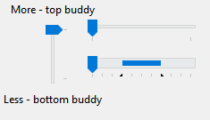
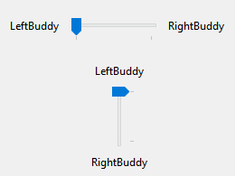
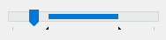
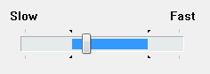

# Slider control
The `Slider` control allows the user to pick a numerical value by dragging a thumb on a slider. Commonly also referred to as a `TrackBar` in Win32 programming.<br>


## Slider Range
To set the range of the slider, use the `Maximum` and `Minimum` properties. To set the value of the slider, set the `Value` property:

```cs
// example: allow millisecond input, 1 ms - 1 s
slider1.Minimum = 1;
slider1.Maximum = 1000;
slider1.Value = 500;
```

## Buddy Controls
A `Slider` can have buddy controls that can appear on the left or right if the `Slider` is horizontal or on the top or bottom when the `Slider` is vertical.<br>


To set the buddy controls, use the `LeftBuddy` and `RightBuddy` properties:
```cs
slider1.LeftBuddy = label1;
slider1.RightBuddy = label2;
```
> [!TIP]
> You can assign any control as the buddy of a slider, including another slider! The only exceptions to this are Forms and the slider that you're setting the buddy on itself.

## Orientation
A `Slider` can be set to `Horizontal` or `Vertical` orientation:
```cs
slider1.Orientation = Orientation.Vertical;
```

## Reverse Sliders
You can reverse a slider to make it so that smaller numbers mean higher and larger numbers mean lower.
```cs
slider1.Reversed = true;
```

You can also reverse the input of the slider separately, by setting the `ReverseInput` property:
```cs
slider1.ReverseInput = true;
```

## Thumb
The thumb on the `Slider` is the actual handle you drag. In the screenshot below, the blue part is the thumb:<br>
<br>
The thumb may look different in different visual styles. For example, this is how a `Slider` may look like under the `Aero` visual style in Windows Vista or Windows 7. Note the fact that the thumb under this visual style is a silver color:<br>
<br><br>

To hide the thumb, use the `IsThumbVisible` property:
```cs
slider1.IsThumbVisible = false;
```

By default, the thumb is automatically sized to fit the `Slider`. To override the width, set the `FixedLength` property to `true` and use the `ThumbLength` property to specify the desired length.
```cs
slider1.FixedLength = true;
slider1.ThumbLength = 10;
```
To get the current `Rectangle` size of the thumb, use the `ThumbRect` property.

## Slider Selection Range
The selection range allows you to define a range that is highlighted by the `Slider`:<br>
<br><br>
<br>
The slider will also show triangular ticks marks at the start and end of the range. To set the selection range, set the `ShowSelectionRange` property to `true` and use the `SelectionRangeStart` and `SelectionRangeEnd` properties to set the desired range:
```cs
slider1.ShowSelectionRange = true;
slider1.SelectionRangeStart = 25;
slider1.SelectionRangeEnd = 75;
```
To clear the selection range, call the `ClearSelectionRange` method.
> [!NOTE]
> The slider's selection range does not affect its functionality in any way. It is up to the application to implement the range. You might do this in one of the following ways:
> - Use a selection range to enable the user to set maximum and minimum values for some parameter. For example, the user could move the slider to a position and then click a button labeled **Max**. The application then sets the selection range to show the values chosen by the user.
> - Limit the movement of the slider to a predetermined subrange within the control, by handling the [ValueChanging](slider.md#validation) event and disallowing any movement outside the selection range. You might do this, for example, if the range of values available to the user can change because of other choices the user has made, or according to available resources.
## Ticks
The `Slider` can be in one of three tick modes: `None`, `Auto`, or `Custom`. `None` indicates no ticks. `Auto` indicates ticks will show up on every single value in the `Slider`'s available range of values. `Custom` indicates that ticks will show up every `X` values in the slider's range, where `X` is the value of the `TickFrequency` property.<br><br>

To set the tick mode, set the `TickMode` property to the desired mode:
```cs
slider1.TickMode = SliderTickMode.None;
```
To use a custom tick amount, set the `TickMode` property to `SliderTickMode.Custom`, and set the `TickFrequency` property to the desired frequency:
```cs
slider1.TickMode = SliderTickMode.Custom;
slider1.TickFrequency = 10;
```
When using a `TickMode` of `Custom`, you can also manually add ticks individually:
```cs
slider1.AddTick(5);
```

> [!NOTE]
> Once a tick is added using `AddTick`, you cannot remove it. If you want to remove a certain tick, you must call the `ClearTicks` method to clear the ticks and re-add the ticks back:
> ```cs
> // add some ticks...
> slider1.AddTick(10);
> slider1.AddTick(12);
> slider1.AddTick(17);
>
> // to remove the tick for 12:
> // clear the ticks...
> slider1.ClearTicks();
> // ...and add back the ticks we want and exclude the ones we don't want
> slider1.AddTick(10);
> slider1.AddTick(17);
> ```
> This is a **Windows limitation**.

To get the current tick positions, call the `GetTickPosition`, `GetTickCount`, or `GetTickPositions` methods.

## Large and Small Change (page/line size)
The small change (also called the "line size") is the amount the `Slider` moves after performing an action such as moving the slider with the arrow keys. To set the small change, use the `SmallChange` property:
```cs
slider1.SmallChange = 1;
```

The large change (also called the "page size") is the amount the `Slider` moves after performing an action such as moving the slider with the `PageUp` or `PageDown` keys. To set the large change, use the `LargeChange` property:
```cs
slider1.LargeChange = 5;
```

## Tooltips
The `Slider` can provide tooltips when the user hovers over the thumb to show the current value. To show the tooltip, use the `ShowToolTip` property:
```cs
slider1.ShowToolTip = true;
```
You can also customize the side where the tooltip appears. To set the tooltip side, use the `ToolTipSide` property:
```cs
slider1.ToolTipSide = SliderToolTipSide.Left; // or: Top, Bottom, Right
```

## Validation
You can validate the value the user drags the slider to and accept or block it. To validate the `Slider`'s value, subscribe to the `ValueChanging` event. The `ValueChanging` event fires before the slider’s value is updated, allowing you to validate or cancel the change.
```cs
slider1.ValueChanging += Slider1_ValueChanging;
```
In the event, perform the neccessary validation checks and set `e.Cancel` to `true` if you want to block the movement operation.
```cs
private void Slider1_ValueChanging(object sender, SliderValueChangingEventArgs e)
{
    // peform validation checks...
    e.Cancel = true;
}
```